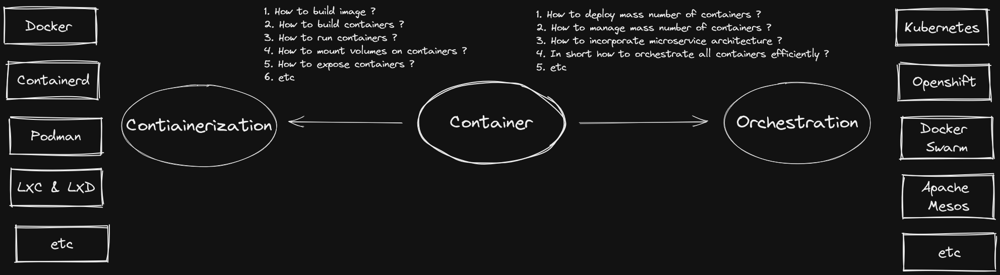
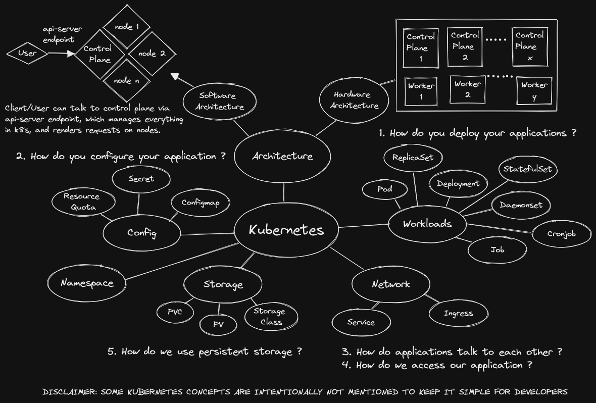

# Description
This a repository for Kubernetes 101 tutorials, demos and cheat sheets for beginners.

# Mind Maps
> **The soul never thinks without a mental image.**  
> **- Aristotle**

Learning any new idea requires three fundamental steps
- **Capture:** Where we capture the information
- **Process:** Where we process the information in our brain. In short understand or comprehend the captured information.

- **Recall:** Where we remember or recall the processed information

It is scientifically proven that our brain process information in terms of images/pictures. Hence mind map is a useful note taking technique when learning new things.

## 1. Moving from Bare metal to VM to Container

**Disclaimer: This image is taken from [Kubernetes Official Website](https://kubernetes.io/docs/concepts/overview/)**

### 1.1 How container is fundamentally different from VMs ?
| Container                            | VMs                                                       |
|--------------------------------------|-----------------------------------------------------------|
| Container is OS level virtualization | Whereas VM is hardware level virtualization               |
| You have only your host OS in system | You will have multilple guest OS along with bins and libs |
| You have only your host kernel       | You have multiple kernel coming with each guest OS        |
### 1.2 Is container is another application/software packing and shipping tool ?
Yes
### 1.3 How is it then different from maven or gradle ?
maven or gradle will package your application with application/code level dependencies. However, it will not package OS level dependencies. Whereas container will package your OS level dependencies.
In short, it's not replacing the build tools. Actually its work on top of build tool
## 2. Map of container, containerization and orechestration
Since we understand container now. Lets try to understand where containerization and orchestration fits into the picture and who are the players in market.


## 3. Kubernetes 101 mindmap for developers
We now understand what container is in reality, how we do containerization and why we need orchestration. Lets now focus on Kubernetes and see how this solves all the modern days problems.
When it comes to DevOps part of Software development, we primarily focus on four questions.
1. **How do you deploy your applications ?** 
2. **How do you configure your application ?**
3. **How do applications talk to each other ?**
4. **How do we use persistent storage ?** 



## 4. Some reference links
- [A visual guide on troubleshooting kubernetes deployments](https://learnk8s.io/a/a-visual-guide-on-troubleshooting-kubernetes-deployments/troubleshooting-kubernetes.en_en.v3.pdf)
- [Learn Kubernetes Basics tutorials](https://kubernetes.io/docs/tutorials/kubernetes-basics/)
- 

# Lets demo something simple
Lets see a simple demo where we deploy an application from scratch.

**Note: I recommend to visit [this](https://github.com/amansharif/microservice-demo) and try to build/run the application first. Then move forward with this demo**
## Prerequisite
- docker
- kind
## How to build and run the docker image ?
- go to docker-image directory ```cd docker-image```
- build the image ```docker build -t <registry/repository/image:tag> .```
- build your container ```docker run --rm -p 80:80 <registry/repository/image:tag>```

#### Examples
```
docker build -t docker.io/aman10/microsvcdemo:v0.0.1 .
docker run --rm -p 80:80 docker.io/aman10/microsvcdemo:v0.0.1
```
## Lets move to Kubernetes now
- Create local k8s cluster with kind ```kind create cluster --config kind-k8s-cluster.yml```
- Deploy Ingress nginx ```kubectl apply -f https://raw.githubusercontent.com/kubernetes/ingress-nginx/main/deploy/static/provider/kind/deploy.yaml```
- Wait until is ready to process requests running ```kubectl wait --namespace ingress-nginx --for=condition=ready pod --selector=app.kubernetes.io/component=controller --timeout=90s```
- Change directory to manifests ```cd manifests```
- Apply/deploy the manifests ```kubectl apply -f .```
- Now open this [link](http://localhost/)